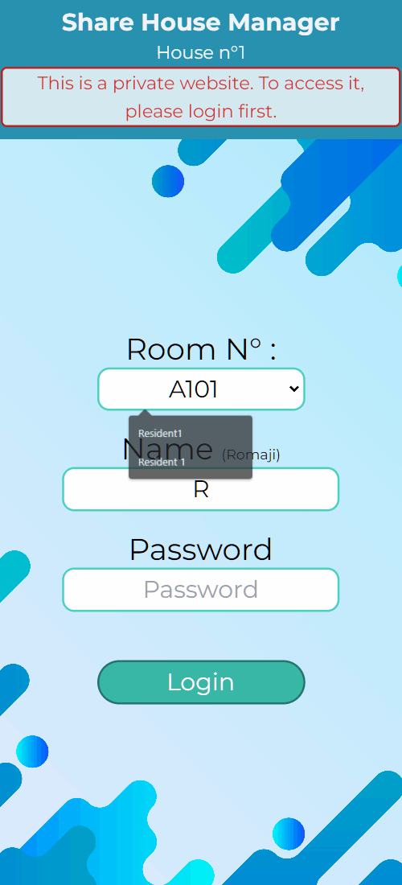
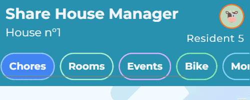
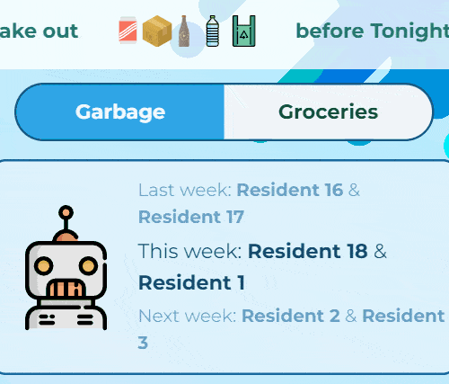
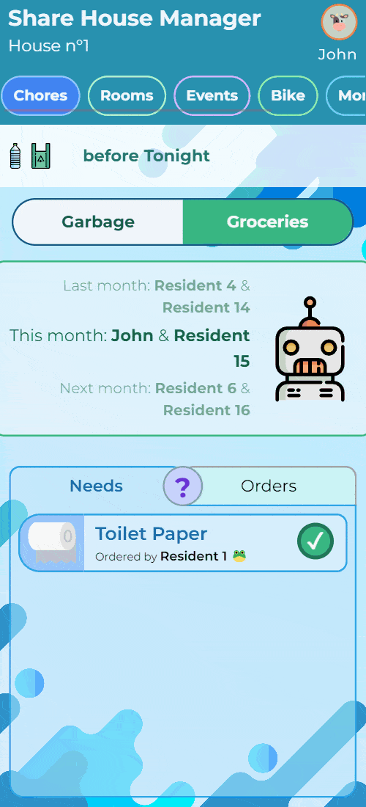
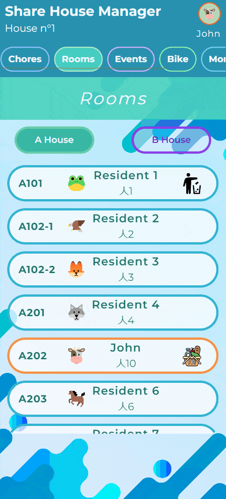
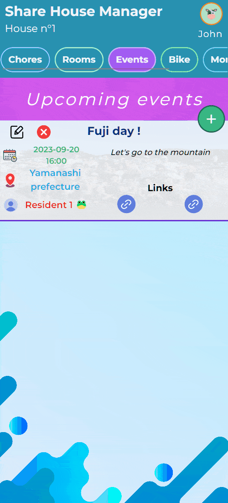
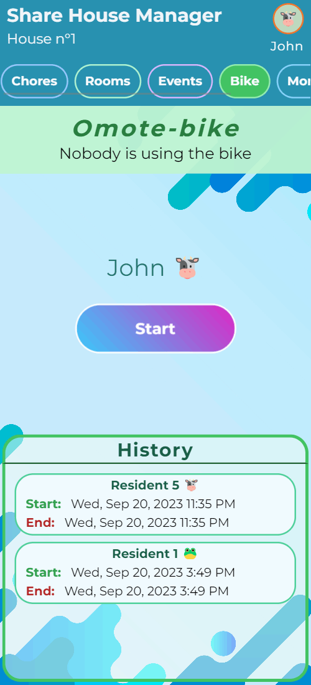

# Share House Manager

**THIS IS A PUBLIC VERSION OF THE APP, FEEL FREE TO EXPERIMENT WITH IT !**

Share House Manager is a smartphone web app that gives residents of a sharehouse a better understanding of the house's rules. For example, the chores rotation, garbage sorting, etc...
Not only the chores, but also differents features such as requesting everyday life common groceries such as toilet paper, plastic bags. The app allows the members to use the common bike with a tracking feature integrated, and features an event manager tool.

## Installation

### Git repository

**1.** Download and install nodeJS

**2.** Clone the repository in your local computer

**3.** Install the dependencies by using the following command

```bash
npm install
```

### Database

This app is powered by a Firebase Database, and thus the access is restricted to the owner of the website.
**1.** Create your own firebase database, and enable those 2 services : Authentication and Firestore.

**2.** Go in the "src > includes > firebase.js" file, and replace the firebaseConfig with the one provided by firestore service in firebase :

```javascript
const firebaseConfig = {
  apiKey: API_KEY,
  authDomain: AUTH_DOMAIN,
  projectId: PROJECT_ID,
  storageBucket: STORAGE_BUCKET,
  messagingSenderId: MESSAGING_SENDER_ID,
  appId: APP_ID
}
```

**3.** In the App.Vue file, uncomment the mounted() lifeCycle action

```javascript
  async mounted() {
    this.createAuthAndFirestoreDB(this.a)
    this.setBike()
    this.setChores(this.b, this.c)
    this.setEventList()
  }
```

> **Note :**
> The credentials are located in the App.Vue state, in the variable called "a". Feel free to change those **before uncommenting the mounted() action** if you want to customize your credentials:

```javascript
data() {
    return {
      tab: 'Chores',
      loggedUser: '',
      userTabTrigger: false,
      logoutBtnMsg: 'Logout',
      a: {
        A101: {
          ...
          residentName: 'Resident 1',
          roomPassword: 'testpassword'
        },
        A1021: {
          ...
          residentName: 'Resident 2',
          roomPassword: 'testpassword'
        },
        A1022: {
           ...
```

**4.** Once everything is setup, run the following command and open a browser tab with the displayed adress:

```bash
npm run dev
```

**5.** Open the developper tool and enable the smartphone view, then refresh the page to see the Login Form appear.

**6.** Once this Form appears, try logging in with the credentials given below. If it works, you can comment back the mounted() function in the App.Vue file.

## Login

The credentials are located in the App.Vue state, in the variable called "a":

```javascript
data() {
    return {
      tab: 'Chores',
      loggedUser: '',
      userTabTrigger: false,
      logoutBtnMsg: 'Logout',
      a: {
        A101: {
          ...
          residentName: 'Resident 1',
          roomPassword: 'testpassword'
        },
        A1021: {
          ...
          residentName: 'Resident 2',
          roomPassword: 'testpassword'
        },
        A1022: {
           ...
```

In the login form, select the right room, then type the resident name and the password to login



## Features

### Auto login

The authentication service provided by firebase emits a login token upon logging in. This token has no expiry date, which means that **the user will stay logged in** as long as he/she doesn't click the "logout" button, or reset the browser's data.

### Profile Overlay

The profile overlay is accessible by pressing the emoji in the top right corner of the screen. This will display the basic tenant's information, as well as giving him/her the possibility to change the name in romaji, name in Japanese, or even to logout if necessary.



### Chores management

**Rotation :**
The rotation for the groceries and garbage are processed automatically by the app, respectively every month and every week. The duos on duty are then announced by a cute little robot.



**Garbage days :**
The chores tab gathers the grocery chore and the garbage chore in one tab. It allows the residents to see the next garbage day, with the different types of garbage to take out. The ribbon is updated automatically, according to the data input in the App.vue file's state "b", more precisely in "daysWeek":

```javascript
data() {
    return {
      b: {
        rotation: {
          0: ['B104', 'B201'],
          ...
        },
        daysWeek: [
          {
            icon: [],
            nextAction: {
              day: 'Tomorrow night',
              type: ['Burn']
            },
            id: 0,
            text: 'Sun'
          },
          {
            nextAction: {
              day: 'Tonight',
              type: ['Burn']
            },
            id: 1,
            icon: ['Throw'],
            text: 'Mon'
          },
          {
           ...
```

You can also see the whole week planning on the "Garbage" tab

**Groceries :** The "Groceries" tab allows tenants to make a request for a specific item they would like the duo on duty to buy for the house. The duo just need to check the "Needs" tab and buy all the requested items, before clearing them.



### Room list

The room tab displays all the rooms in the house, with the tenants informations such as name, name in Japanese, room number, and also the icons telling who is on chores duty at the moment.



### Events

The event tab allow tenants to create their own event in the house, letting everyone know about the time and place of an event. It is also possible to add URLs.

Events are editable and deletable by clicking on the icons on the left side of one event box.



### Bike

The bike tab allows tenants to register themselves when they use the shared bike. By clicking the **"Start"** button, the lock passcode will appear, as well as a **"Stop"** button.

When the user is done with the bike, he/she will press the "Stop" button to reset the it's state. This will also create an entry in the "History" area.



### Money

[Coming soon]

### Noise

[Coming soon]
